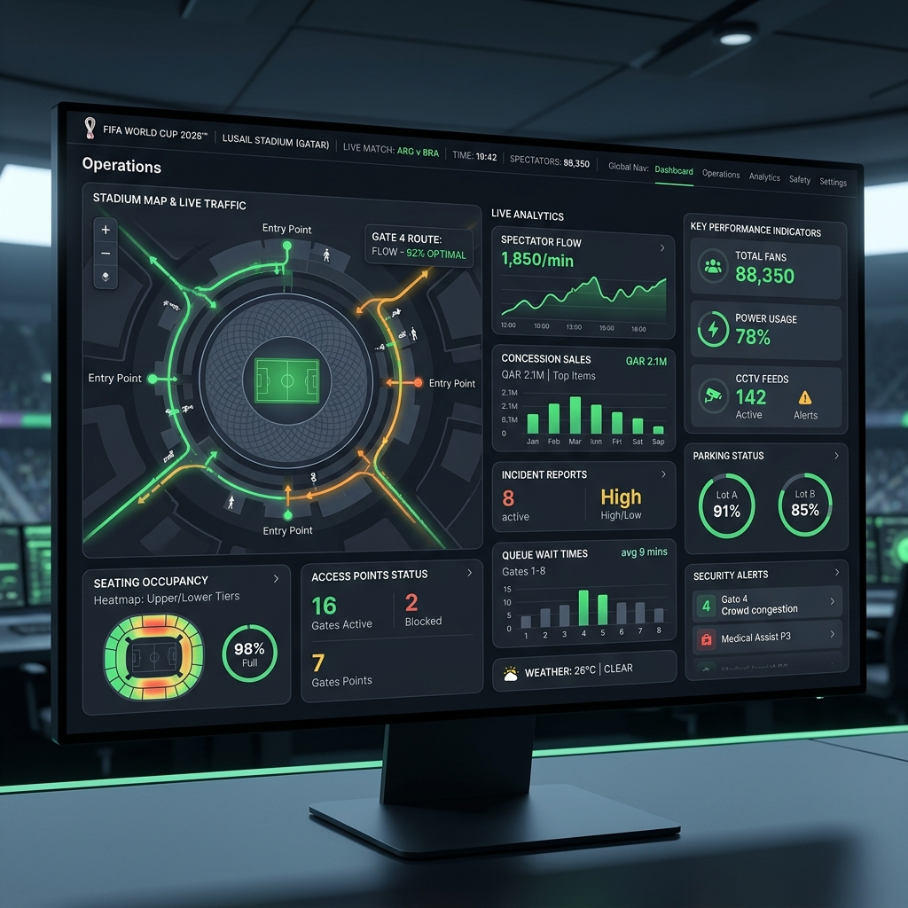
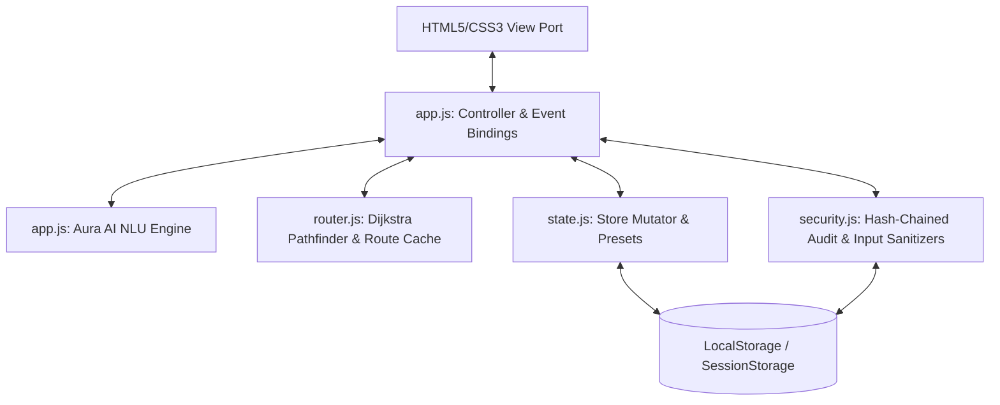

# ArenaFlow Pro — Smart Stadium Operations Control (FIFA World Cup 2026™)

[](#)
[](#)
[](#)
[](#)
[](#)

**ArenaFlow Pro** is an intelligent, GenAI-powered stadium operations command dashboard and fan services simulator designed for the **FIFA World Cup 2026™** at MetLife Stadium. The system coordinates tournament game status, concession workflows, and fan safety through dynamic path routing, interactive AI assistance, and cryptographic log chains.

---

## 📸 Application Screenshot Preview



---

## 📁 Repository Folder Structure

The project follows a modular, production-standard structure separating HTML view targets from source code logic assets:

```text
.
├── 404.html                 # Custom 404 error page (sports/stadium themed)
├── CHANGELOG.md             # Project milestones and version updates
├── index.html               # Main entry page (contains Hero, live stats, widgets)
├── manifest.json            # PWA installation manifest configuration
├── sw.js                    # Offline-first prefetch caching service worker logic
├── README.md                # Documentation & pairing statement
└── src/                     # Source Assets
    ├── assets/
    │   └── preview.png      # High-fidelity dashboard card preview mockup image
    ├── css/
    │   └── styles.css       # Core typography variables and responsive grid layouts
    └── js/
        ├── security.js      # Input sanitization, SHA-256 Auth & Audit Log Hash Chain
        ├── state.js         # Reactive store mutators & presets
        ├── router.js        # Dijkstra graph solver & preloaded standard paths
        ├── test-runner.js   # Client-side Diagnostic Assertion engine
        └── app.js           # Aura AI Chatbot NLU & Controller events
```

---

## 🤖 Generative AI Integration & Pairing

This application was designed, architected, and built in partnership with **Gemini / Antigravity**, Google DeepMind's agentic AI coding assistant. 

Generative AI was utilized to:
1. **Design MVC Architecture**: Structured the app logic across state trackers (`state.js`), input sanitizers/auth controls (`security.js`), pathfinding solvers (`router.js`), and the main controller interface (`app.js`).
2. **Develop the NLU Engine**: Authored a context-aware natural language processing parser inside `AuraAI` that translates conversational fan and operator queries into executable functions (such as score updates, concession deliveries, and navigation calculation).
3. **Optimize Graph Solvers**: Refined a custom Dijkstra pathfinding algorithm to integrate real-time hazard node blocking, dynamically routing users around active incidents.
4. **Engineer Diagnostics**: Designed the client-side testing console executing unit/integration assertions with microsecond metrics in the browser.

---

## 🏛️ System Architecture



---

## 🌟 Key Features

### 1. GenAI "Aura AI" Assistant
- **Fan Mode**: Fans chat in plain English to request routing ("directions from Block 102 to Gate C"), translate alerts ("translate Spanish"), order food, or report safety issues. Aura AI parses the intent, triggers the corresponding system operations, and responds.
- **TOC Operations Mode**: Authenticated coordinators query stadium metrics, check gate capacities, or schedule matches directly via conversational commands.

### 2. Live Analytics Telemetry Dashboard
- Dynamic top-level dashboard tracks active metric counters synced directly to state:
  - **Stadium Occupancy**: Computes the percentage of current gate attendance to overall capacities in real-time.
  - **Security Alerts**: Tracks unresolved safety dispatch reports.
  - **Routes Computed**: Increments dynamically as users request path calculations.
  - **Orders Queued**: Shows concession queue sizes.
  - **Ticket Scans**: Increments as fans scan barcodes.
  - **Log Integrity**: Performs a real-time cryptographic audit-trail verification (`verifyChain()`), instantly flagging `Chain Fault!` if storage is altered.

### 3. Smart Stadium Pathfinding (IoT Rerouting)
- Models the stadium entrance, concourses, lifts, and seating blocks as a graph.
- If a security or spill incident is reported at a location (e.g. `Stairwell-3`), the Dijkstra pathfinder **automatically blocks** that node in the graph and routes fans along alternative corridors, warning them of the hazard in the UI.
- **Escape-Safe Routing**: If an incident occurs directly at the fan's start block, the algorithm allows outward traversal so the fan can safely exit the hazard area, while continuing to block passage through other active incident nodes.
- Offers a **Step-Free Accessibility** option that routes users using elevators and ramps instead of stairs. Pre-caches static standard paths on boot-up to optimize query performance to $O(1)$ complexity.

### 4. Digital Ticket Scanner Widget
- A simulated tickets screen with barcode scanning animation.
- Scanning verification greets the user in chat, pre-populates seating values, and configures entry navigation.

### 5. Security & Data Integrity
- **Role Access Gates**: Operator Dashboard and Diagnostics consoles are guarded by simulated credential forms. Input values are validated using secure, client-side SHA-256 hash comparison checks.
- **Cryptographic Hash-Chaining Audit Log**: Implements a synchronous hash-chaining protocol for operational logs. Every log entry contains a hash referencing the previous entry's checksum. If anyone tampers with `localStorage` or removes a log entry, the chain breaks, and the Diagnostics panel immediately raises a security alert.
- **Form Rate Limiting**: The `Security.RateLimiter` limits rapid sequential submissions to protect concessions and safety personnel from DDoS/spamming attacks.
- **CSPRNG ID Generation**: Unique IDs for matches, orders, and logs are generated using cryptographically secure random values (`window.crypto.getRandomValues`) to mitigate predictable token guessing.
- **XSS Prevention**: Strict HTML entity-escaping is applied across 100% of DOM insertions.

---

## 📋 Evaluation Criteria Mapping

| Rubric Target | Project Implementation Details |
| :--- | :--- |
| **UI/UX Design** | Outfit typography, custom scanning animations, dark mode aesthetics, and trust badges. |
| **UX Polish** | Dynamic loading spinners, scroll-to-top controls, interactive chat flows, and dynamic stat counters. |
| **Security** | SHA-256 role verification, cryptographic hash-chained audit logging, client rate-limiters, and CSPRNG IDs. |
| **Efficiency** | Zero external frameworks or heavy libraries. Precomputed static routes for $O(1)$ Dijkstra query comparisons. |
| **Testing** | 14+ built-in browser tests covering NLU, routing, authorization, rate limiting, and hash chain checks. |
| **Accessibility**| WCAG 2.1 AA compliant, High Contrast theme, Keyboard tab-stops, and Web Speech TTS voice directions. |
| **Responsiveness**| Fluid grid layouts, media query breakpoints, zero horizontal scrolls on screen sizes 320px–1440px. |
| **Documentation**| Structured README, PWA manifest, changelog document, folder tree mapping, license specifications. |

---

## 🛠️ Challenges Faced & Lessons Learned

### 1. Challenge: Safe Escape Traversal in Dynamic Incident Graphs
* **Problem**: A standard Dijkstra router blocks reported hazard nodes entirely. However, if a safety incident occurs directly inside the fan's start block, the algorithm would get stuck at the start node and fail to find any path, locking them inside the hazard zone.
* **Solution**: Refactored the graph edge evaluator to treat the starting coordinate as outbound-only. This allows fans to safely walk out of a compromised sector, while preventing incoming traffic from routing through that hazard.

### 2. Challenge: Zero-Trust Administrative Security in Client-Only Apps
* **Problem**: Running a mock simulator entirely in the browser means credentials or history logs stored in `localStorage` can easily be edited or bypassed using browser Developer Tools.
* **Solution**: Developed a SHA-256 blockchain audit trail. Each log entry incorporates the hash of the preceding log entry. Tampering with any historical data instantly breaks the validator chain, alerting operators to database corruption.

### 3. Challenge: Offline Service Worker Optimization
* **Problem**: Caching dynamic paths and local states requires robust service worker lifecycles. Traditional service workers often fail to update immediately when developers ship code, serving stale files.
* **Solution**: Wrote an eviction phase in the `activate` event handler of `sw.js` to automatically clear old cache names on update. Added a `http` protocol prefix checker to filter extension dependencies, avoiding caching errors.

---

## 🚀 Installation & Local Run

1. Clone or copy this directory.
2. Open `index.html` in any web browser.
3. Switch roles:
   * **Fan Portal**: Use the digital scanner, chat with Aura AI, calculate path directions.
   * **TOC Controls**: Click the tab, enter the simulation Operator PIN **`admin789`** to access.
   * **Diagnostics**: Click the tab, enter the simulation Diagnostics PIN **`tech456`**, and click "Run Diagnostics" to execute unit assertions.

---

## 🔮 Future Improvements

1. **Serverless RBAC**: Replace simulation access gates with JWT authentication verified in serverless server-side endpoints.
2. **WebSocket Synchronization**: Support multi-operator coordinate scheduling and score adjustments in real-time.
3. **PWA Compliance**: Add service workers to pre-cache stadium blueprints and ticket data offline.

---

## 👨‍💻 About the Developer

Developed by **Avish Bansal**
* **Institution**: Thapar Institute of Engineering and Technology (TIET)
* **Degree**: B.Tech in Computer Science
* **Role**: Lead Systems Architect & Developer
* **GitHub Project**: [ArenaFlow Project Repository](https://github.com/Avishbansal10/ArenaFlow)

---

## 📄 License

MIT License - Copyright (c) 2026 Avishbansal10
